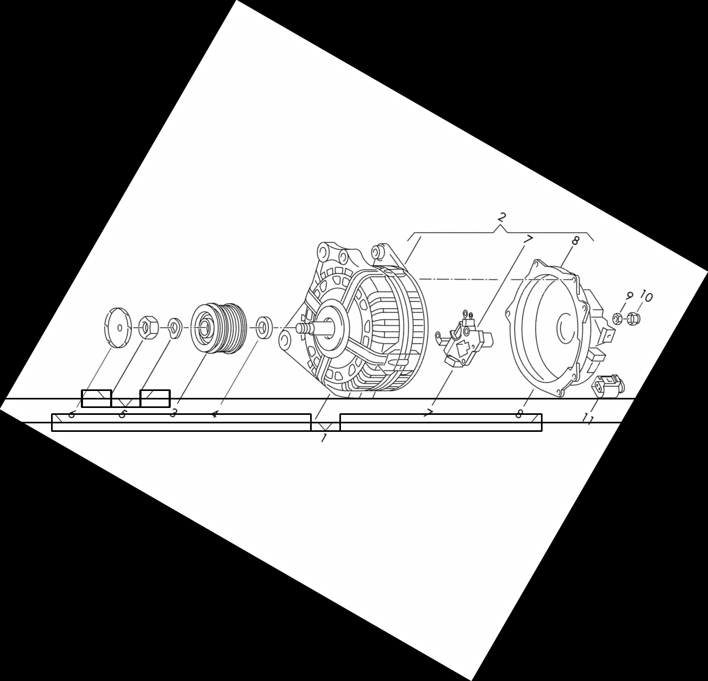
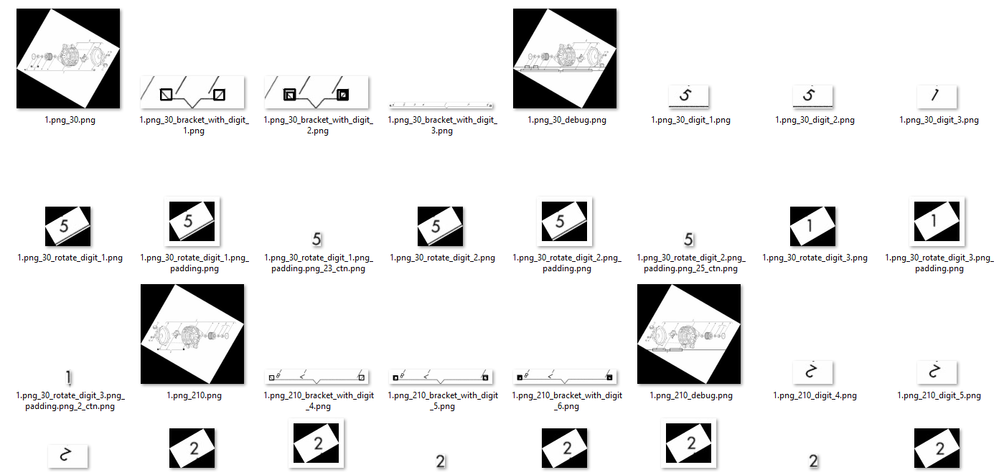
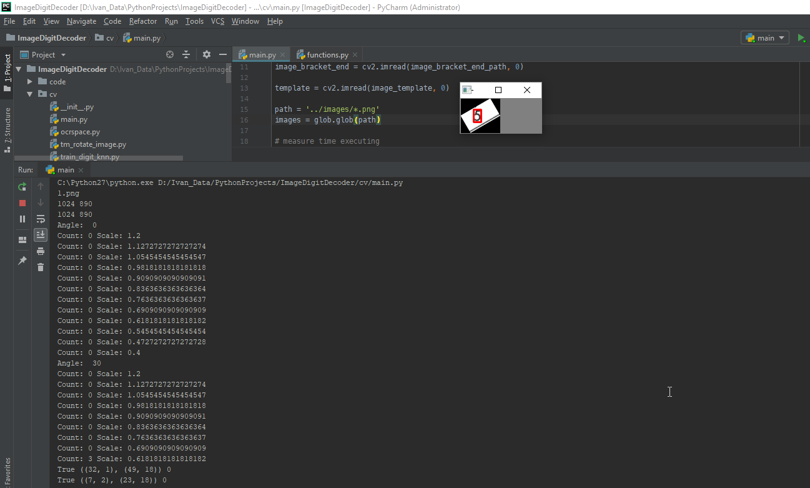
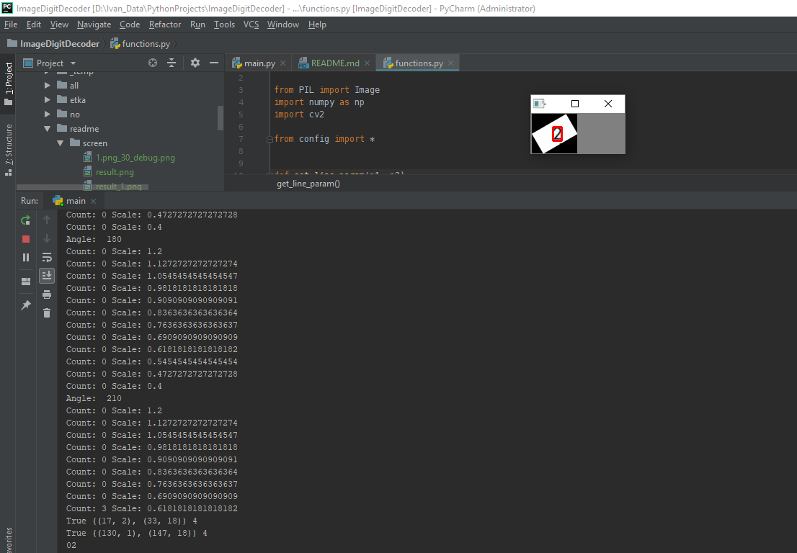

<h1>Tool for digit detection & recognition</h1>

Example of input image: 

This project in not finished.

## Dependencies

These scripts need python 2.7.x and the following libraries to work:

1. sklearn==0.0
2. imutils==0.5.1
3. numpy==1.15.2
4. opencv-python==3.4.3.18
5. Pillow==5.3.0
6. scikit-learn==0.20.0
7. scipy==1.1.0

1. Install python. Just use the installer from [python's website](https://www.python.org/downloads/)
2. Install numpy.
3. Install python-opencv. Download the release from [its sourceforge site](http://sourceforge.net/projects/opencvlibrary/files/). 
(Choose the release based on your operating system, then choose version 2.4.12). 
The executable is just an archive. Extract the files, then copy `cv2.pyd` to the `lib/site-packages` folder on your python installation path.
Fow Windows you can take `cv2.pyd` file from repo, directory `/libs/cv2`.
4. Install pip. Download [the script for installing pip](https://bootstrap.pypa.io/get-pip.py), open cmd (or termianl if you are using Linux/Mac OS X), go to the path where the downloaded script resides, and run `python get-pip.py`
5. Install pillow. Run `pip install pillow`. 
6. Install scikit-learn. Run `pip install scikit-learn`

## Execution

Run this file `cv/main.py`

## Results

## LICENSE

This project is licensed under the MIT License - see the [LICENSE](LICENSE) file for details